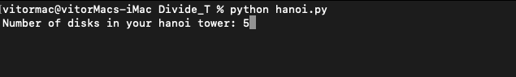
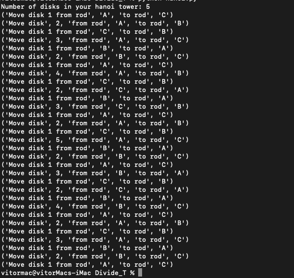

# D-C Hanoi_Tower

**Número da Lista**: 4<br>
**Conteúdo da Disciplina**: Dividir e Conquistar<br>

## Alunos
|Matrícula | Aluno |
| -- | -- |
| 16/0148375 |  Vitor Leal dos Santos |
| 16/0119316  | Ezequiel de Oliveira dos Reis |

## Sobre 
O Projeto tem como objetivo demonstrar os movimentos a serem feitos para resolver o problema de torre de hanoi para N discos.

## Screenshots
[](./screenshot.png)


[](./screenshot.png)

## Instalação 
**Linguagem**: Python<br>
Após clonar o repositório, entrar na pasta do projeto e inserir o seguinte comando:

```python hanoi.py```

## Uso 
  Ao iniciar o projeto é necessário informar a quantidade de discos que existem na torre e seguir os passos informados para resolver o problema.